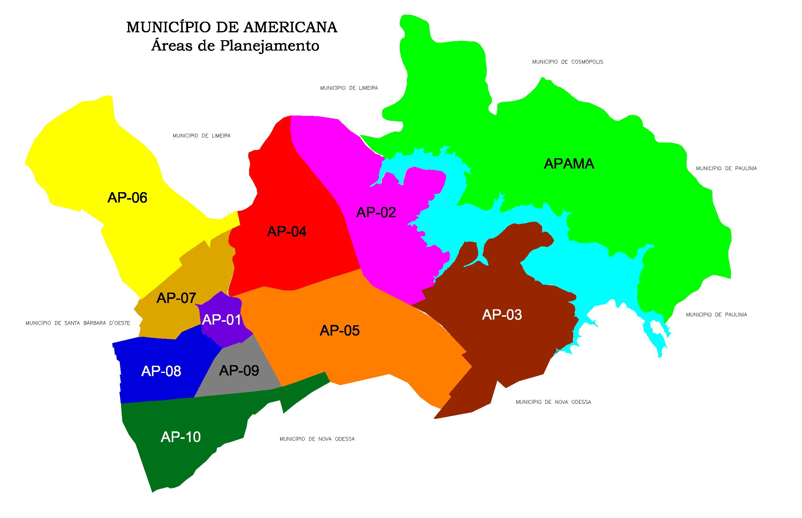

```{r setup, include=FALSE}
knitr::opts_chunk$set(echo = TRUE)
```
    
```{r e18-01, message=FALSE, warning=FALSE, echo=FALSE}
#Bibliotecas
library(data.table)
library(sqldf)
library(highcharter)
library(dplyr)
library(knitr)
library(rmarkdown)
library(DT)
library(leaflet)
library(leaflet.extras)

datatable_idioma <- "https://cdn.datatables.net/plug-ins/1.10.11/i18n/Portuguese-Brasil.json"
```

```{r e18-02, message=FALSE, warning=FALSE, echo=FALSE}
# Carregar Dados
df_locais_votacao <- read.csv('data/eleicoes_2018/base_locais_votacao.csv', sep=';')
df_candidaturas <- read.csv('data/eleicoes_2018/base_candidatura_eleicao_geral_2018_dep_estadual.csv', sep=';')
df_partidos <- read.csv('data/eleicoes_2018/base_partidos.csv', sep = ';')
df_votacao <- read.csv('data/eleicoes_2018/base_votacao_eleicao_geral_t1_2018_dep_estadual.csv', sep = ';')
df_zona_secao_locais <- read.csv('data/eleicoes_2018/base_zona_secao_locais.csv', sep=';')
```

```{r e18-03, message=FALSE, warning=FALSE, include=FALSE}
#str(df_locais_votacao)
head(df_locais_votacao, n=5)
```

<br />

## Introdução

Nesta página estão contidas a visualização das informações das *Eleições gerais de 2018, para o cargo de deputado estadual cujos votos foram dados por eleitores e eleitoras da cidade de Americana / SP*. O objetivo é conferir aos interessados a possibilidade de análise de desempenho dos partidos no geral, e de forma mais direcionada do PSOL e do campo da Esquerda. 

Os dados são públicos e foram retirados do portal do TSE, tratados e organizados de forma cuidadosa por mim, e espero que atendam as necessidades da militância. Dúvidas e sugestões só entrar em contato, obrigado!

<b>Obs 1:</b> Os gráficos, tabelas e mapas são interativos: Nas **tabelas** pode-se ordenar e filtrar os dados, nos **gráficos** pode-se clicar nas legendas para mudar a visualização, e ao colocar o mouse sobre as barras pode-se ver informações adicionais; o **mapa** pode-se dar zoom e clicar sobre os ícones para ver informações adicionais.

<b>Obs 2:</b> Em todas as análises foram omitidas contagens de votos *menores que 10* para não poluir os gráficos e tabelas.

---

## Análises

<br />

### Partidos

Aqui teremos uma tabela mostrando a quantidade de votos que cada partido (e seus espectros políticos) recebeu na cidade, bem como os votos brancos e nulos.

<br />

```{r e18-04, message=FALSE, warning=FALSE, include=FALSE}

### Análise dos bairros
### Análise das candidaturas
```

```{r e18-05, message=FALSE, warning=FALSE, echo=FALSE}

sql <- "SELECT SUM(v.qt_votos) as Votos, p.nr_legenda as Legenda, p.sigla as Sigla, p.espectro as EspectroAbrev, p.espectro_completo as Espectro
        FROM df_partidos p
        LEFT JOIN df_votacao v ON v.nr_legenda = p.nr_legenda
        GROUP BY p.nr_legenda, p.sigla, p.espectro, p.espectro_completo
        ORDER BY Votos DESC"
df_gr_votos_partido_espectro <- sqldf(sql)

df_gr_votos_partido <- df_gr_votos_partido_espectro %>% group_by(Sigla) %>% summarise(total = sum(Votos)) %>% arrange(desc(total))

#paged_table(df_gr_votos_partido, options = list(rows.print = 10))

datatable(df_gr_votos_partido_espectro[,c("Sigla", "Espectro", "Votos")], options = list(pageLength = 7, autoWidth = TRUE, language = list(url = datatable_idioma))) 

```


```{r e18-06, message=FALSE, warning=FALSE, echo=FALSE}
# Gráfico
df_gr_votos_partido %>% 
  hchart(type="column", hcaes(x=df_gr_votos_partido$Sigla, y=total), name="Votos") %>%
  hc_title(text = 'Votos para deputado estadual por partido') %>%
  hc_subtitle(text = "Fonte: TSE ") %>%
  hc_yAxis(title = list(text = "Votos")) %>%
  hc_xAxis(title = list(enabled=FALSE)) %>%
  hc_add_theme(hc_theme_ffx()) %>%
  hc_size(NULL, 500)
```

<br />

---

### Espectro político

Vamos agora ampliar a visão dos votos, demonstrando como os habitantes de Americana votaram em termos de espectro político.

<br />

```{r e18-07, message=FALSE, warning=FALSE, echo=FALSE}

sql <- "SELECT 
          SUM(v.qt_votos) as Votos, p.nr_legenda as Legenda, p.sigla as Sigla, p.cd_espectro, p.espectro as EspectroAbrev, p.espectro_completo as Espectro
        FROM df_partidos p 
        LEFT JOIN df_votacao v ON v.nr_legenda = p.nr_legenda
        WHERE p.espectro <> ''
        GROUP BY p.nr_legenda, p.sigla, p.cd_espectro, p.espectro, p.espectro_completo
        HAVING Votos > 10
        ORDER BY p.cd_espectro ASC, Votos DESC"
sqldf(sql) -> df_gr_votos_partido_espectro

```


```{r e18-08, message=FALSE, warning=FALSE, include=FALSE}

df_gr_votos_espectro <- df_gr_votos_partido_espectro %>% 
  group_by(Espectro) %>% 
  summarise(Total = sum(Votos)) %>% 
  arrange(desc(Total))

df_gr_votos_espectro

```


```{r e18-09, message=FALSE, warning=FALSE, echo=FALSE}
datatable(df_gr_votos_espectro, options = list(autoWidth = TRUE, language = list(url = datatable_idioma)))
```

```{r e18-10, message=FALSE, warning=FALSE, echo=FALSE}

#colors <- c("#a13942", "#b57076", "#c9a6a9", "#717171", "#7b9cab", "#4b8dab", "#1c7fac")
colors <- c("#717171", "#7b9cab", "#c9a6a9", "#4b8dab", "#b57076", "#1c7fac", "#a13942")

df_gr_votos_partido_espectro %>% 
  arrange(cd_espectro, desc(Votos)) %>%
  hchart(type="column", hcaes(x=Sigla, y=Votos, name=Espectro, group=Espectro)) %>%
  hc_plotOptions(column = list(grouping = FALSE)) %>%
  hc_tooltip(pointFormat = "Votos: {point.Votos:,.0f} <br /> Espectro: <b>{point.Espectro}</b>", sort = FALSE, table = FALSE) %>% 
  hc_legend(align = "center", verticalAlign = "bottom", format = "{point.Espectro}") %>% 
  hc_title(text = 'Votos para deputado estadual por partido e por espectro político') %>%
  hc_subtitle(text = "Fonte: TSE ") %>%
  hc_yAxis(title = list(text = "Votos")) %>%
  hc_xAxis(title = list(enabled=FALSE)) %>%
  hc_add_theme(hc_theme_google()) %>%
  hc_colors(colors) %>%
  hc_size(NULL, 600) %>%
  hc_credits(enabled = TRUE, text = "CuriosiDados", href = "https://heavyrick.github.io/datascience/")

```

<br />

---

### Geral por bairros

Agora vamos para uma análise territorial, tentando entender como os votos foram distribuídos pela cidade. Americana possui duas zonas eleitorais, e dentro de cada zona dezenas de seções, distribuídas em 58 escolas (dentre algumas faculdades) da cidade.

Primeiro vamos observar as áreas de planejamento que dividem a cidade de Americana.

<br />

```{r e18-11, echo=FALSE, out.width="100%", fig.align='center'}

```

Nesta tabela temos a soma de votos de todos partidos.

<br />

```{r e18-12, message=FALSE, warning=FALSE, echo=FALSE}

sql <- "SELECT SUM(v.qt_votos) as Votos, l.cd_bairro, l.nm_bairro, l.area_planejamento as AP
        FROM df_votacao v
        LEFT JOIN df_zona_secao_locais z ON v.nr_zona = z.nr_zona AND v.nr_secao = z.nr_secao
        LEFT JOIN df_locais_votacao l ON l.id = z.id_local_votacao
        GROUP BY l.cd_bairro, l.nm_bairro, l.area_planejamento
        HAVING Votos > 10
        ORDER BY Votos DESC"
df_gr_bairro <- sqldf(sql)

datatable(df_gr_bairro[,c("nm_bairro", "AP", "Votos")], 
          colnames = c('Bairro' = 'nm_bairro'), 
          options = list(autoWidth = TRUE, language = list(url = datatable_idioma)))

```

<br />

Agora vamos abrir os dados e dividí-los por partidos e espectros.

<br />

```{r e18-13, message=FALSE, warning=FALSE, echo=FALSE}

sql <- "SELECT 
          SUM(v.qt_votos) as Votos, l.cd_bairro, l.nm_bairro, l.area_planejamento as AP, v.nr_legenda, p.sigla,
          p.espectro as EspectroAbrev, p.espectro_completo as Espectro
        FROM df_votacao v
        LEFT JOIN df_partidos p ON p.nr_legenda = v.nr_legenda
        LEFT JOIN df_zona_secao_locais z ON v.nr_zona = z.nr_zona AND v.nr_secao = z.nr_secao
        LEFT JOIN df_locais_votacao l ON l.id = z.id_local_votacao
        GROUP BY l.cd_bairro, l.nm_bairro, l.area_planejamento, v.nr_legenda, p.sigla, p.espectro, p.espectro_completo
        HAVING Votos > 10
        ORDER BY Votos DESC"
df_gr_bairro_partido <- sqldf(sql)

datatable(df_gr_bairro_partido[,c("nm_bairro", "sigla", "Espectro", "AP", "Votos")], 
          colnames = c('Bairro' = 'nm_bairro', "Partido" = "sigla"), 
          options = list(autoWidth = TRUE, language = list(url = datatable_idioma)))

```

<br />

---

### PSOL por bairros

Agora vamos verificar as localidades onde o PSOL recebeu votos para deputado estadual.

<br />

```{r e18-14, message=FALSE, warning=FALSE, echo=FALSE}

sql <- "SELECT SUM(v.qt_votos) as Votos, l.cd_bairro, l.nm_bairro, l.area_planejamento as AP
        FROM df_votacao v
        LEFT JOIN df_zona_secao_locais z ON v.nr_zona = z.nr_zona AND v.nr_secao = z.nr_secao
        LEFT JOIN df_locais_votacao l ON l.id = z.id_local_votacao
        WHERE v.nr_legenda = 50
        GROUP BY l.cd_bairro, l.nm_bairro, l.area_planejamento
        HAVING Votos > 10
        ORDER BY Votos DESC"

df_gr_bairro_psol <- sqldf(sql)

datatable(df_gr_bairro_psol[,c("nm_bairro", "AP", "Votos")], 
          colnames = c('Bairro' = 'nm_bairro'), 
          options = list(autoWidth = TRUE, language = list(url = datatable_idioma)))

```


```{r e18-15, message=FALSE, warning=FALSE, echo=FALSE}

df_gr_bairro_psol %>% 
  arrange(desc(Votos)) %>%
  hchart(type="column", hcaes(x=nm_bairro, y=Votos, group=AP)) %>%
  hc_plotOptions(column = list(grouping = FALSE)) %>%
  #hc_tooltip(pointFormat = "Votos: {point.Votos:,.0f} <br /> Espectro: <b>{point.Espectro}</b>", sort = FALSE, table = FALSE) %>% 
  hc_legend(align = "center", verticalAlign = "bottom", format = "{point.AP}") %>% 
  hc_title(text = 'Votos para deputado estadual do PSOL por bairro e APs') %>%
  hc_subtitle(text = "Fonte: TSE ") %>%
  hc_yAxis(title = list(text = "Votos")) %>%
  hc_xAxis(title = list(enabled=FALSE)) %>%
  hc_add_theme(hc_theme_economist()) %>%
  #hc_colors(colors) %>%
  hc_size(NULL, 600) %>%
  hc_credits(enabled = TRUE, text = "CuriosiDados", href = "https://heavyrick.github.io/datascience/")

```


```{r e18-16, message=FALSE, warning=FALSE, echo=FALSE}

sql <- "SELECT 
          SUM(v.qt_votos) as Votos, l.ds_local, l.latitude as lat, l.longitude as lng, l.nm_bairro, v.nr_legenda 
        FROM df_votacao v
        LEFT JOIN df_zona_secao_locais z ON v.nr_zona = z.nr_zona AND v.nr_secao = z.nr_secao
        LEFT JOIN df_locais_votacao l ON l.id = z.id_local_votacao
        WHERE v.nr_legenda = 50
        GROUP BY 
          l.ds_local, l.latitude, l.longitude, l.nm_bairro, v.nr_legenda
        ORDER BY Votos DESC"
df_gr_locais_psol <- sqldf(sql)

```

<br />

O mapa a seguir é para dar uma dimensão mais visual dessa distribuição, basta clicar em cada ícone no mapa para visualizar as informações. 

Obs: Escala do círculo *x50*, círculos mais escuros são locais com mais de 100 votos.

<br />

```{r e18-17, message=FALSE, warning=FALSE, echo=FALSE, out.width = '100%'}
# mapa_votos <- function(df) {
# leaflet(data = df, width ='100%') %>% addTiles() %>%
#   addMarkers(~lng, ~lat, 
#              popup = paste(
#                 "<p><b>", as.character(df$ds_local), "</b> <br />",
#                 "Bairro: ", as.character(df$nm_bairro), " </p>",
#                 "<p><b>", as.character(df$Votos), " Votos</b> <br /> </p>"
#              ), 
#              label = paste("Votos: ", as.character(df$Votos)),
#              labelOptions = labelOptions(noHide = F, direction = "bottom",
#                                          style = list(
#                                            "color" = "red",
#                                            "font-family" = "serif",
#                                            "font-style" = "bold",
#                                            "box-shadow" = "3px 3px rgba(0,0,0,0.25)",
#                                            "font-size" = "12px",
#                                            "border-color" = "rgba(0,0,0,0.5)"
#                                          )))
# }
# 
# mapa_votos(df_gr_locais_psol)

mapa_votos_circulo <- function(df){
  # Ref: https://rstudio.github.io/leaflet/markers.html
  
  leaflet(df) %>% 
    addTiles() %>%
    addCircles(lng = ~lng, lat = ~lat, weight = 1, color=~ifelse(Votos > 100, '#340012', '#cc0048'),
             #color=~ifelse((espectro == 'E' | espectro == 'EE' | espectro == 'CE'), "red", "blue"),
      radius = ~sqrt(Votos) * 50, 
      #stroke = TRUE, fillOpacity = 0.5,
       popup = paste(
                "<p><b>", as.character(df$ds_local), "</b> <br />",
                "Bairro: ", as.character(df$nm_bairro), " </p>",
                "<p><b>", as.character(df$Votos), " Votos</b> <br /> </p>"
             ),
    ) %>% 
    addProviderTiles(providers$OpenMapSurfer.Roads) 
}
# OpenStreetMap.BZH
mapa_votos_circulo(df_gr_locais_psol)

```

<br />

---

### Espectro à esquerda por bairros

<br />

```{r e18-18, message=FALSE, warning=FALSE, echo=FALSE}

sql <- "SELECT SUM(v.qt_votos) as Votos, l.cd_bairro, l.nm_bairro, l.area_planejamento as AP, p.espectro as EspectroAbrev, p.espectro_completo as Espectro
        FROM df_votacao v
        LEFT JOIN df_partidos p ON p.nr_legenda = v.nr_legenda
        LEFT JOIN df_zona_secao_locais z ON v.nr_zona = z.nr_zona AND v.nr_secao = z.nr_secao
        LEFT JOIN df_locais_votacao l ON l.id = z.id_local_votacao
        WHERE p.espectro IN ('EE', 'CE', 'E')
        GROUP BY l.cd_bairro, l.nm_bairro, l.area_planejamento, p.espectro, p.espectro_completo
        HAVING Votos > 10
        ORDER BY Votos DESC"

df_gr_bairro_esquerda <- sqldf(sql)

df_gr_bairro_esquerda_ee <- df_gr_bairro_esquerda[df_gr_bairro_esquerda$EspectroAbrev == 'EE', ]
df_gr_bairro_esquerda_ce <- df_gr_bairro_esquerda[df_gr_bairro_esquerda$EspectroAbrev == 'CE', ]
df_gr_bairro_esquerda_e <- df_gr_bairro_esquerda[df_gr_bairro_esquerda$EspectroAbrev == 'E', ]

datatable(df_gr_bairro_esquerda[,c("nm_bairro", "Espectro", "AP", "Votos")], 
          colnames = c('Bairro' = 'nm_bairro'), 
          options = list(autoWidth = TRUE, language = list(url = datatable_idioma)))

```


```{r e18-19, message=FALSE, warning=FALSE, echo=FALSE}

highchart() %>%
  hc_chart(type = "column") %>% 
  hc_yAxis(title = list(text = "Votos")) %>%
  hc_xAxis(title = list(enabled=FALSE), categories = unique(df_gr_bairro_esquerda$nm_bairro)) %>%
  hc_add_series(name="Extrema Esquerda", df_gr_bairro_esquerda_ee$Votos, color='#670606')%>%
  hc_add_series(name="Esquerda", df_gr_bairro_esquerda_e$Votos, color='#f21818')%>%
  hc_add_series(name="Centro Esquerda", df_gr_bairro_esquerda_ce$Votos, color='#f66060')%>%
  hc_title(text = 'Votos para deputado estadual do espectro à Esquerda') %>%
  hc_subtitle(text = "Fonte: TSE ") %>%
  hc_plotOptions(series=list(stacking='normal')) %>%
  hc_add_theme(hc_theme_ffx()) %>%
  hc_size(NULL, 600) %>%
  hc_credits(enabled = TRUE, text = "CuriosiDados", href = "https://heavyrick.github.io/datascience/")

```

<br />

E agora uma visualização mostrando apenas os votos dos espectros à esquerda por AP.

<br />

```{r e18-20, message=FALSE, warning=FALSE, echo=FALSE}

df_gr_ap_esquerda <- df_gr_bairro_esquerda %>% group_by(AP, Espectro, EspectroAbrev) %>% summarise(Votos = sum(Votos))

df_gr_ap_esquerda_ee <- df_gr_ap_esquerda[df_gr_ap_esquerda$EspectroAbrev == 'EE', ]
df_gr_ap_esquerda_ce <- df_gr_ap_esquerda[df_gr_ap_esquerda$EspectroAbrev == 'CE', ]
df_gr_ap_esquerda_e <- df_gr_ap_esquerda[df_gr_ap_esquerda$EspectroAbrev == 'E', ]

#is.atomic(df_gr_bairro_esquerda)
#df_gr_ap_esquerda_ee[['Votos']]

highchart() %>%
  hc_chart(type = "column") %>%
  hc_xAxis(categories = unique(df_gr_ap_esquerda$AP)) %>%
  hc_yAxis(title = list(text = "Votos")) %>%
  hc_add_series(data=df_gr_ap_esquerda_ee$Votos, name="Extrema Esquerda", color='#670606')%>%
  hc_add_series(data=df_gr_ap_esquerda_ce$Votos, name="Esquerda", color='#f21818')%>%
  hc_add_series(data=df_gr_ap_esquerda_e$Votos, name="Centro Esquerda", color='#f66060')%>%
  hc_title(text = 'Votos para deputado estadual do espectro à Esquerda por AP') %>%
  hc_subtitle(text = "Fonte: TSE ") %>%
  hc_plotOptions(series=list(stacking='normal')) %>%
  hc_add_theme(hc_theme_ffx()) %>%
  hc_size(NULL, 550) %>%
  hc_credits(enabled = TRUE, text = "CuriosiDados", href = "https://heavyrick.github.io/datascience/")

```

---

```{r e18-21, message=FALSE, warning=FALSE, include=FALSE}

sql <- "SELECT 
          SUM(v.qt_votos) as Votos, l.area_planejamento as AP, p.nr_legenda, p.Sigla, p.espectro as EspectroAbrev, 
          p.espectro_completo as Espectro
        FROM df_votacao v
        LEFT JOIN df_partidos p ON p.nr_legenda = v.nr_legenda
        LEFT JOIN df_zona_secao_locais z ON v.nr_zona = z.nr_zona AND v.nr_secao = z.nr_secao
        LEFT JOIN df_locais_votacao l ON l.id = z.id_local_votacao
        WHERE p.espectro IN ('EE', 'CE', 'E')
        GROUP BY l.area_planejamento, p.nr_legenda, p.Sigla, p.espectro, p.espectro_completo
        HAVING Votos > 10
        ORDER BY Votos DESC"
df_gr_ap_partido_esquerda <- sqldf(sql)

#unique(df_gr_ap_partido_esquerda$sigla)

df_gr_ap_partido_esquerda_pcdob <- df_gr_ap_partido_esquerda[df_gr_ap_partido_esquerda$sigla == 'PCdoB', ]
df_gr_ap_partido_esquerda_pdt <- df_gr_ap_partido_esquerda[df_gr_ap_partido_esquerda$sigla == 'PDT', ]
df_gr_ap_partido_esquerda_psb <- df_gr_ap_partido_esquerda[df_gr_ap_partido_esquerda$sigla == 'PSB', ]
df_gr_ap_partido_esquerda_psol <- df_gr_ap_partido_esquerda[df_gr_ap_partido_esquerda$sigla == 'PSOL', ]
df_gr_ap_partido_esquerda_pt <- df_gr_ap_partido_esquerda[df_gr_ap_partido_esquerda$sigla == 'PT', ]

```

<br />

(*) No gráfico abaixo foram retirados os partidos com votação baixa (Rede, PMN e PPL)

<br />

```{r e18-22, message=FALSE, warning=FALSE, echo=FALSE}

highchart() %>%
  hc_chart(type = "column") %>%
  hc_xAxis(categories = unique(df_gr_ap_esquerda$AP)) %>%
  hc_yAxis(title = list(text = "Votos")) %>%
  hc_add_series(name="PSB", df_gr_ap_partido_esquerda_psb$Votos, color="#cc6600")%>%
  hc_add_series(name="PSOL", df_gr_ap_partido_esquerda_psol$Votos, color="#ffcc00")%>%
  hc_add_series(name="PDT", df_gr_ap_partido_esquerda_pdt$Votos, color="#cc66cc")%>%
  hc_add_series(name="PT", df_gr_ap_partido_esquerda_pt$Votos, color="#f21818")%>%
  hc_add_series(name="PCdoB", df_gr_ap_partido_esquerda_pcdob$Votos, color="#990033")%>%
  hc_title(text = 'Votos para deputado estadual dos partidos do espectro à Esquerda por AP *') %>%
  hc_subtitle(text = "Fonte: TSE ") %>%
  hc_plotOptions(series=list(stacking='normal')) %>%
  hc_add_theme(hc_theme_google()) %>%
  hc_size(NULL, 500) %>%
  hc_credits(enabled = TRUE, text = "CuriosiDados", href = "https://heavyrick.github.io/datascience/")

```

---

<br />

## Referências

- <a href="https://www.americana.sp.gov.br/americanaV6_index.php?it=38&a=perfil_areas_planejamento" target="_blank">Prefeitura de Americana - Áreas de Planejamento</a>

<br />
